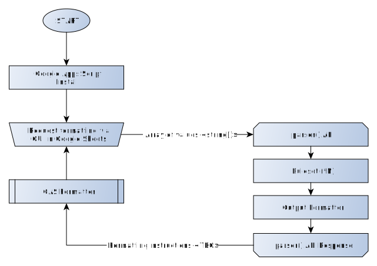

# Loquor

  [](https://www.repostatus.org/#wip) [](https://www.codacy.com/gh/jamesrwilliams/loquor/dashboard?utm_source=github.com&amp;utm_medium=referral&amp;utm_content=jamesrwilliams/loquor&amp;utm_campaign=Badge_Grade)

A translation script that parses strings and returns ranges of non-HTML/Templating syntax used by a corresponding Google Apps Script file to format strings as rich text on output.  With the aim is to speed up complex translation requests by automatically highlighting translation tokens of correct strings to translate. 

This project is made up of two parts, a Google Apps Script to handle interfacing with a Google Sheet, reading values and applying formatting to our output, and an API server that handle the parsing of the input data from the Google Sheet.

The overall goal being when provided with something like this:

`<p>Please <a target="_top" href="%retry.url%">click here</a> to try your purchase again.</p>`

Is formatted automatically to look like this:

<p><span style="color: #f00">&lt;p&gt;</span>Please <span style="color: #f00">&lt;a target="_top" href="%retry.url%"&gt;</span>click here<span style="color: #f00">&lt;/a&gt;</span> to try your purchase again.<span style="color: #f00">&lt;/p&gt;</span></p>

---

> The API portion of this application deploys automatically to https://loquor.herokuapp.com. It is running as a free [Heroku dyno](https://www.heroku.com/dynos) so might take some time to respond initially as it starts up.
 
## Contents

  - [Getting started](#getting-started)
  - [Google Apps Script](#the-google-app-script)
  - [Tests](#tests)
  - [System Overview](#system-overview)
  - [Todo](#todo)

## Getting Started

- Run `npm i` to install dependencies
- Use `npm start` to run the node API server locally.
- Use `npm run develop` to run the server with [nodemon](https://nodemon.io/) to automatically restarts the node server.

### Developing locally

To work on formatting rules locally you can use any software or app to send HTTP POST requests to the local server (I'd recommend [Postman](https://www.postman.com/)). Start by sending a POST request to the `/parse` URL for your local server ([localhost:3000/parse](http://localhost:3000/parse)) passing a payload of the following:

```json
{
    "entries": [
        ["<p>Hello world</p>"]
    ]
} 
```

This will then return the following:

```json
[[[3, 13]]]
```

Ideally you set up a test in `./test.js` then add your functionality to ensure the response is correct.

> **Please note** - The parser only ever responds with an array of found translation strings that are safe to translate and should always fail safe and default to not being translatable.

### Tunnel using Ngrok

You can use [Ngrok](https://ngrok.com/) to tunnel the Google Apps Script to your local machine during development. To get started follow the [setup instructions](https://dashboard.ngrok.com/get-started/setup) and then run:

```bash
develop:ngrok
```

This script then exposes your local server from running `npm start` on a randomly generated public URL ( http://XXXXXXXXXXXX.ngrok.io ). 

 Changing the `ENDPOINT` constant at the top of the [app.gs](./google-app-script/app.gs) file (when added to your Google App Script installation) to your HTTPs Ngrok tunnel URL will route the script requests to your local server.

## The Google App Script

The source code for this component can be found in the `./google-app-script` directory. This interfaces with the Google Sheet of translations and handles the formatting of the cells. This script registers a custom menu, and a corresponding menu option to trigger the script processing.

This script then reads all the values from the `B2-B999` range and sends that as a HTTP request to the server endpoint configured in the script. The API responds with a 2d array of results, first dimension representing the row, and subsequent arrays are substrings we're highlighting for translation with two numbers being their start and end offsets of their original string.

This component script fails safe. It will assume the whole string is not translatable unless a provided range of characters is provided denoting substrings that need translating.

## Formatting rules

Below is a summary of the expected behaviour of the parser library in relation to the various templating and sample strings we're expecting.

Implementation status badges
  - Completed: ✅
  - In Progress:  ⚠️ 
  - Pending: ⚪

| Ruleset | Rule | Example Input | Example Output | Status |
| --- | --- | ----- | --- | --- |
| Handlebars | Do not format `{}` wrapped strings | `{foo}` | <span style="color: red;">{foo}</span> | ⚠️ |
| Twig | Do not format `%` wrapped strings | `%foo%` | <span style="color: red;">%foo%</span> |  ⚠️ |
| HTML | Do not format HTML tags | `<p>Foo<p/>` | <span style="color: red;">&lt;p&gt;</span>Foo<span style="color: red;">&lt;/p&gt;</span> | ⚠️ |
| HTML | Do not format encoded HTML entities | `Hello&nbsp;World` | Hello<span style="color: red;">&amp;nbsp;</span>World | ⚠️ |
| URLs | Do not format URLs (both relative and absolute) | `../../foo/src.img` | <span style="color: red;">../../foo/src.img</span> | ⚠️ |

## System Overview



## Tests

Test suite written with [Mocha](https://mochajs.org/) & [Chai](https://www.chaijs.com/) to ensure the`parser()` function correctly processes strings. 

```bash
npm test
```

Tests are broken into separate "rule sets" that break out similar groups of assurances, such as plaintext vs HTML based tests. 

_Please note: These tests **do not** cover the Google App Script. Only the formatting logic of the API_

## Todo
  - [ ] Handle non-latin characters - Unsure of the requirement here as we're always using English as the base input and translating from there.
  - [ ] Expand script behavior to cover full sample

